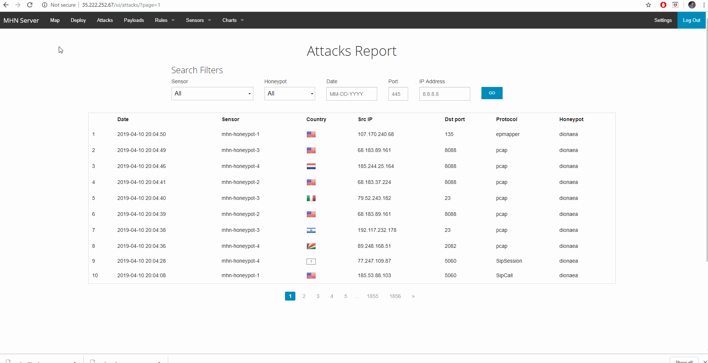

# Week10-11-Honeypots
Deploying a honeypot to capture different attacks
1- Which Honeypot(s) you deployed
The honeypot which I deployed is Dionaea over HTTP, through MHN honeypot VM. 
How Dionaea works -dionaea intention is to trap malware exploiting vulnerabilities exposed by services offerd to a network, the ultimate goal is gaining a copy of the malware.

2- Any issues you encountered
When I installed the VM with machine-type - "f1-micro", the external ip did not work on the browserr and was not able to get to the mhn-admin-console page. Then I uninstalled the VM and installed it again with machine-type - "g1-small". The VM worked fine and I was able to get to the mhn-admin console and deploy the instance. I think I was the RAM issue and it needed moe RAM for the instance. 

3- A summary of the data collected: number of attacks, number of malware samples, etc.
I had a total of 18213 attacks-:
+ Honeypot 1 - 4957
+ Honeypot 2 - 8139
+ Honeypot 3 - 2353
+ Honeypot 4 - 2769
I had different ports attacked such as sipcall, sipSession, pcap, sqld, smbd. 

A screeshot of the VM console -:

